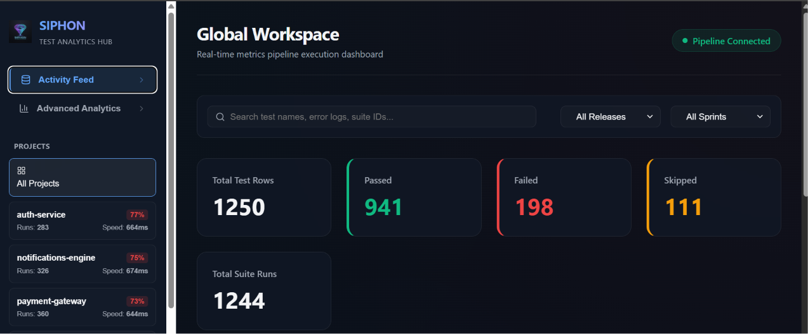
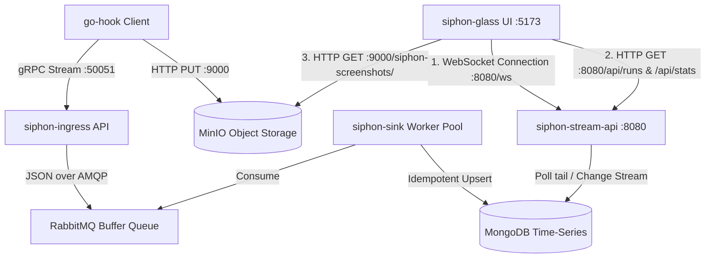

# Siphon — Real-time Open-Source Test Analytics Platform

Siphon is a high-throughput, real-time open-source test analytics platform designed to capture automated test suite execution metrics, manage screenshots of test failures via object storage, and stream live execution feeds straight to an interactive, premium engineering dashboard.



---

## Architecture & Communication Overview

Siphon is built on a decoupled, microservice-oriented event pipeline. Here is how the UI and other services communicate with each other:



### Ingestion Pipeline (Source to Database)
* **gRPC Streaming:** Test runner clients (like `go-hook`) stream binary test run data using Protocol Buffers directly to `siphon-ingress` on port `50051`.
* **MinIO Storage:** Test clients upload error screenshot files directly to MinIO Object Storage (port `9000` / `9001`) via HTTP.
* **Message Queue:** `siphon-ingress` serializes the incoming Protobuf payloads into JSON and publishes them to RabbitMQ (`siphon-buffer-queue`) to act as a buffer.
* **Database Ingest:** The `siphon-sink` worker pool consumes messages from RabbitMQ and inserts/updates them idempotently into a MongoDB Time-Series collection.

### UI Communication Details
The React UI (`siphon-glass`) interacts with backend services through three primary channels:
1. **WebSocket Protocol (`ws://localhost:8080/ws`):** On application mount, the UI opens a persistent WebSocket connection to the `siphon-stream-api` service. As new test results land in MongoDB, the `siphon-stream-api` tailing thread detects them and broadcasts them in real time over the WebSocket channel. The UI receives these events and appends them dynamically to the **Activity Feed** without requiring a page refresh.
2. **REST API Endpoint Requests (`http://localhost:8080/api/...`):**
   * `GET /api/runs`: Used to fetch the initial batch of recent test runs when the page loads, or to fetch filtered runs when a user selects a project, release, sprint, or enters a search query.
   * `GET /api/stats`: Used to fetch aggregated metrics (status distribution, run counts, project-wise pass rates, and sprint trends) which populate the counters and analytics charts.
3. **Asset Loading (`http://localhost:9000/siphon-screenshots/...`):** When a test case fails and contains a failure screenshot link, the UI directly fetches and renders the physical PNG image from the public MinIO bucket.

---

## Repository Structure

The project is managed inside a Go workspace (`go.work` multi-module layout) alongside a React web application:

```
siphon/
├── apps/
│   └── siphon-glass/            # Vite + React + TS dashboard client (Recharts, Lucide)
├── services/
│   ├── siphon-ingress/          # Go gRPC stream ingestion edge service (Binary Protobuf)
│   ├── siphon-sink/             # Go consumer worker pool inserting to MongoDB
│   └── siphon-stream-api/       # Go Gorilla WebSocket server tailing Mongo
├── shared/
│   ├── proto/                   # Protobuf schema and compiled Go bindings
│   └── telemetry/               # Shared OpenTelemetry configuration utilities
├── clients/
│   ├── go-hook/                 # Mock client framework simulation
│   └── seeder/                  # High-volume mock database seeder (1000s of records)
├── docker/                      # MongoDB init indexing script
└── docker-compose.yml           # Core database, broker, and LGPL observability configuration
```

---

## Tech Stack & Port Configuration

| Service | Port | Technology | Purpose |
| :--- | :--- | :--- | :--- |
| **`siphon-glass`** | `5173` | React, Recharts, Lucide | Premium, dark-mode real-time visual dashboard |
| **`siphon-ingress`** | `50051` | Go, gRPC, RabbitMQ | High-performance metrics edge stream ingestion |
| **`siphon-sink`** | *Daemon* | Go, MongoDB | Concurrent worker pool executing idempotent data writes |
| **`siphon-stream-api`** | `8080` | Go, Gin, WebSockets | WebSockets and REST endpoint data stream tailer |
| **MongoDB** | `27017` | MongoDB Community | Document database storing flat test metadata |
| **Mongo Express** | `8081` | Web Console UI | Visual interface for exploring Mongo database collections |
| **RabbitMQ** | `5672` / `15672` | RabbitMQ + Management | Event queue buffering ingestion spikes |
| **MinIO** | `9000` / `9001` | MinIO Storage Engine | Object storage bucket storing failed test screenshots |
| **Grafana** | `3000` | Grafana Dashboard | LGPL telemetry dashboard for metrics, traces, and Loki logs |

---

## Production-Grade Enhancements

The codebase implements several advanced systems engineering principles:
* **Binary Protobuf Broker Pipeline**: Instead of slow JSON parsing on the edge API, `siphon-ingress` forwards raw binary protobuf packets (`proto.Marshal`) directly to RabbitMQ using the `application/x-protobuf` content-type. The consumer pool (`siphon-sink`) performs the deserialization, minimizing ingestion latency.
* **Dead Letter Exchanges (DLX)**: If messages are malformed or fail to process, they are rejected with a `Nack(false, false)` and routed to the direct exchange `siphon-dlx-exchange` and stored in `siphon-dlq` to prevent consumer lockups.
* **MongoDB Time-Series Storage**: The test results are persisted in a native MongoDB Time-Series collection partitioned chronologically via `timeField: "timestamp"` and `metaField: "project"`, ensuring query optimizations and data compaction.
* **Idempotency Standard**: Unique compound index `{ "execution_id": 1, "test_case_id": 1 }` avoids duplicate runs.

---

## Setup & Running the Project

### Prerequisites
* Go v1.22+
* Node.js v18+
* Docker Desktop

### 1. Launch local Infrastructure Services
```bash
docker compose up -d
```

### 2. Seed the Database
To populate the dashboard with 1,250 historical test results across multiple projects (`siphon-core`, `payment-gateway`, `auth-service`, `notifications-engine`), releases, and sprints:
```bash
go run clients/seeder/seeder.go
```

### 3. Run Go microservices (Concurrently in background)
```bash
go run services/siphon-ingress/main.go
go run services/siphon-sink/main.go
go run services/siphon-stream-api/main.go
```

### 4. Start the Web Dashboard Client
```bash
cd apps/siphon-glass
npm run dev
```
Open `http://localhost:5173/` in your browser. Use the top filters and search bar to drill down into the live test metrics.
